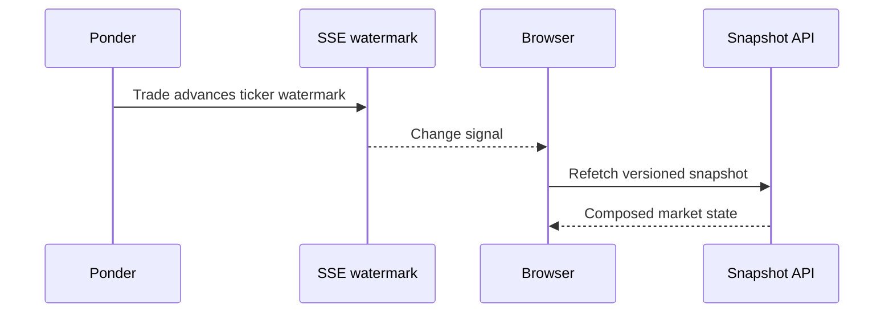

The Next.js server composes readable content with Ponder projections, while the browser uses direct RPC for wallet-sensitive values and contract writes.

## Public read API

| Route | Purpose |
| --- | --- |
| `GET /api/topics` | Published V3 metadata with indexed market summaries |
| `GET /api/topics/:topicId` | One linked topic by onchain ID, UUID, or metadata URI |
| `GET /api/topics/:topicId/snapshot` | Versioned ticker, dense candles, arguments, activity, and participants |
| `GET /api/topics/:topicId/candles` | Paginated dense candle history |
| `GET /api/topics/:topicId/ticker` | Latest indexed ticker |
| `GET /api/topics/:topicId/arguments` | Indexed arguments enriched with content and optional user votes |
| `GET /api/topics/:topicId/activity` | Recent indexed activity and participant addresses |
| `GET /api/positions?user=...` | Indexed position candidates enriched with reserve data |
| `GET /api/comments` | Published comments with matching active indexed arguments |

The browser requests these routes with `cache: "no-store"`. Snapshot and positions responses also set explicit no-store headers. React Query provides client caching, visibility-aware refresh, and invalidation after transactions.

## Server write API

The server stages readable content and finalizes verified receipts:

```text
POST  /api/topics
PATCH /api/topics/:stagedId
POST  /api/comments
PATCH /api/comments/:stagedId
```

The server verifies topic and argument creation receipts, including the expected factory or market, transaction sender, relevant events, factory registry, reserve descriptor, emitted component identities, and topic clone code.

## Direct wallet transactions

Financial and user-authorized social actions bypass server signing:

- create and optionally seed a topic;
- buy or sell side tokens;
- stake or unstake conviction;
- create or deactivate a post;
- allocate or remove votes; and
- claim staker, creator, or platform rewards where the product exposes them.

<Note>
  The application server never signs these transactions and never receives a user's private key.
</Note>

## Live market updates

The Next.js snapshot is the single market-page and chart payload. Ponder exposes only a narrow SSE signal:

```http
GET /live/markets/:chainId/:topicId
```

The route redirects to a fixed, parameterized query selecting only the ticker watermark. Arbitrary SQL, unrelated tables, and other `/sql/*` routes are rejected.

When the watermark advances, the browser invalidates its active snapshot query. The SSE event does not carry the market payload.



## Correctness under disconnects

SSE accelerates freshness but is not required for correctness:

- every successful connection triggers a refresh to close reconnect gaps;
- active and quiet adaptive polling remain enabled;
- snapshots are revalidated after successful transactions; and
- no financial value is accepted directly from an SSE payload.

This preserves one versioned composition and validation boundary even when a browser misses update signals.