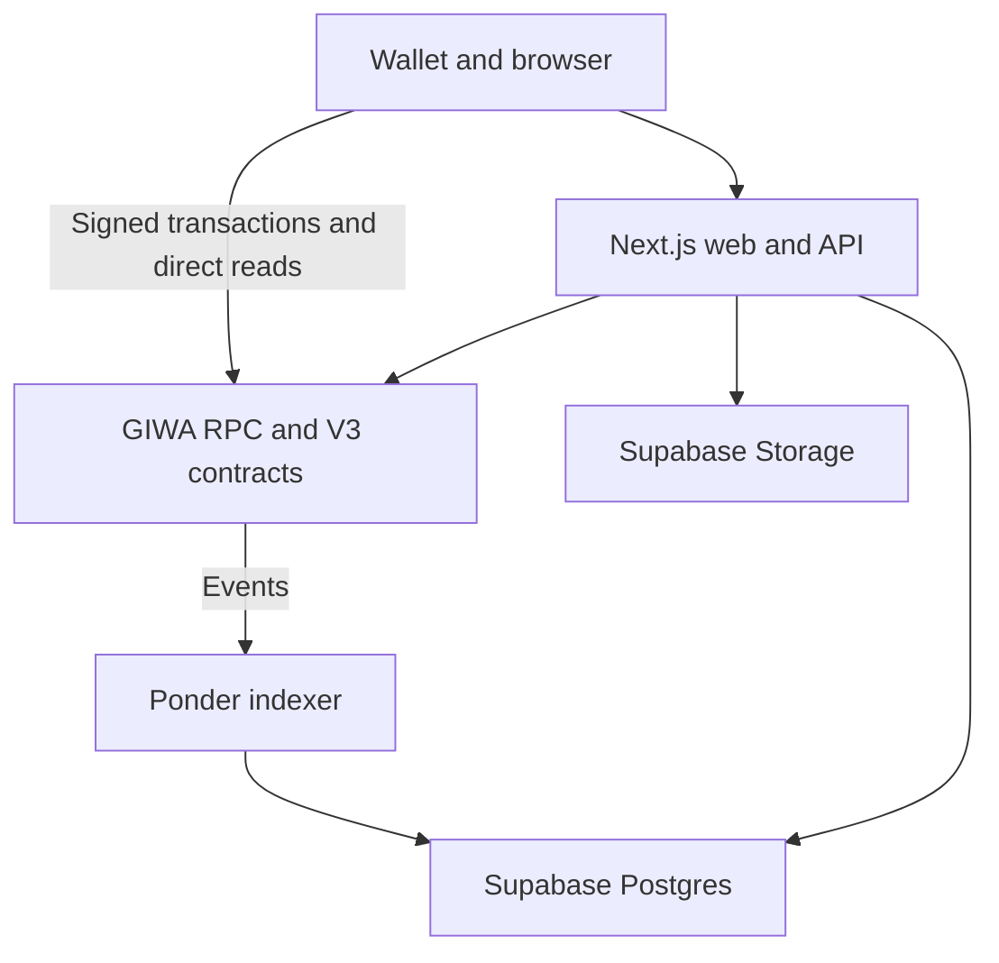

DualClash V3 separates financial authority, public indexing, readable content, and wallet interaction so each layer has a narrow responsibility.

<Info>
  **Current scope:** Tomborg V3 on GIWA Sepolia, chain ID `91342`. Tomborg is the repository and protocol name; DualClash is the product name.
</Info>

## System context

The browser signs contract writes. The server stages content, verifies receipts, and serves composed read models; it never transacts for the user.

## Core invariant

> An offchain record is never publication authority. A topic is published only by `TopicCreated`; an argument is published only by `PostCreated`.

## Sources of truth

| Concern | Authority |
| --- | --- |
| Reserves, settlement, supply, ownership, stake, votes, and rewards | V3 contracts and reserve tokens |
| Topic publication | `DebateTopicFactoryV3.TopicCreated` |
| Argument publication | `TopicMarketBaseV3.PostCreated` |
| Content pointer | URI stored onchain |
| Readable MVP content | `public.topics` and `public.comments` resolving `tomborg://` URIs |
| Public history and charts | Rebuildable Ponder projections |
| Current wallet-sensitive values | Direct contract reads |
| Display-only USD values | Stored hourly reference; never used in settlement |

## Repository boundaries

| Component | Responsibility |
| --- | --- |
| `packages/contracts` | Solidity, Foundry tests, deployment, ABI generation, and verification |
| `packages/indexer` | Ponder ingestion, projections, candles, USD references, and restricted live signals |
| `packages/web` | Next.js UI and APIs, staging, receipt verification, wallet integration, and media |
| `packages/core` | Shared validation, types, hashing, presets, curve previews, and candle utilities |
| `packages/simulations` | Economic scenarios against production contracts on local Anvil |
| `supabase/migrations` | Production roles, DDL, private schemas, and Storage configuration |

`packages/web/contracts/deployedContracts.ts` is the generated deployment registry used by the web application, indexer, and verification tools. V2 remains only as deployment history.

## Consistency model

The chain, index, and content store are eventually consistent:

- confirmed events outrank staged addresses or amounts;
- receipt verification provides the fast linking path;
- Ponder reconciliation repairs interrupted browser finalization;
- direct RPC reads correct wallet-sensitive indexed values;
- snapshot polling closes missed SSE gaps; and
- projections can be rebuilt from the V3 factory deployment block.

<Warning>
  Finalization currently uses one confirmation. Ponder can repair indexed state after a reorg, but a deeply reorged receipt may leave a stale content link. Production use requires deeper confirmation or canonicality repair.
</Warning>

## Explicit non-goals

V3 has no resolution, expiry, liquidation, winning side, AMM graduation, liquidity migration, post-launch fee changes, market pause, admin mutation of existing topics, or multi-chain operation. Arweave is a target, not a current feature.