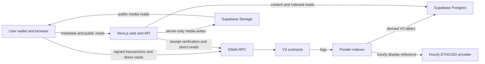

DualClash V3 separates financial authority, public indexing, readable content, and wallet interaction so each layer has a narrow responsibility.

<Info>
  **Current scope:** V3 on GIWA Sepolia, chain ID `91342`. The repository and protocol use the name Tomborg; the product UI uses DualClash.
</Info>

## System context

The browser signs contract writes through the connected wallet. The web server stages content, verifies receipts, and serves composed read models; it never transacts on the user's behalf.

## Core invariant

> An offchain record is never publication authority. A topic is published only by `TopicCreated`, and an argument is published only by `PostCreated`.

## Sources of truth

| Concern | Authority | How it is used |
| --- | --- | --- |
| Reserves and payouts | V3 topic contracts and reserve tokens | Never inferred from Postgres |
| Side-token supply and ownership | `SideToken` contracts | Indexed positions are discovery and cache data |
| Stakes, votes, posts, and rewards | Topic market, vaults, and distributors | Contract events create the public projection |
| Topic publication | `DebateTopicFactoryV3.TopicCreated` | A staged `topics` row is not public |
| Argument publication | `TopicMarketBaseV3.PostCreated` | A staged `comments` row starts inactive |
| Content pointer | URI stored onchain | Permanent for the topic or post |
| Readable content in the MVP | `public.topics` and `public.comments` | Resolves current `tomborg://` URIs |
| Public history | Ponder V3 schema | Rebuildable from contract logs |
| Current wallet state | Direct contract reads | Corrects or enriches indexed candidates |
| Display-only USD value | Stored hourly reference | Never enters contract math |

## Repository boundaries

| Component | Responsibility |
| --- | --- |
| `packages/contracts` | Solidity, Foundry tests, deployment, ABI generation, and verification |
| `packages/indexer` | Ponder ingestion, projections, candles, USD references, and restricted live updates |
| `packages/web` | Next.js UI and APIs, content staging, receipt verification, wallet integration, and media |
| `packages/core` | Shared validation, types, content hashing, preset resolution, curve previews, and candle utilities |
| `packages/simulations` | Economic scenarios using production contracts on local Anvil |
| `supabase/migrations` | Production roles, DDL, private schemas, and Storage configuration |

`packages/web/contracts/deployedContracts.ts` is the generated deployment registry consumed by the web application, indexer, and verification tooling. V2 entries remain as deployment history, but V3 is the only current application architecture.

## Consistency model

The chain, index, and content store are eventually consistent:

- Confirmed events outrank conflicting staged addresses or amounts.
- Receipt verification is the fast linking path.
- Ponder reconciliation repairs interrupted browser finalization.
- Direct RPC reads correct wallet-sensitive indexed state.
- Snapshot polling closes missed SSE update gaps.
- Ponder projections can be rebuilt from the V3 factory start block.

<Warning>
  The application currently finalizes after one confirmation. Ponder repairs its derived state after a reorg, but a deeply reorged receipt can leave a stale link in `public.topics` or `public.comments`. A higher-value deployment needs deeper confirmation or a canonicality repair job.
</Warning>

## Explicit non-goals

V3 does not implement market resolution, expiry, liquidation, a winning side, AMM graduation, liquidity migration, post-launch fee changes, market pausing, or multi-chain operation. Arweave content is a target architecture, not a current feature.