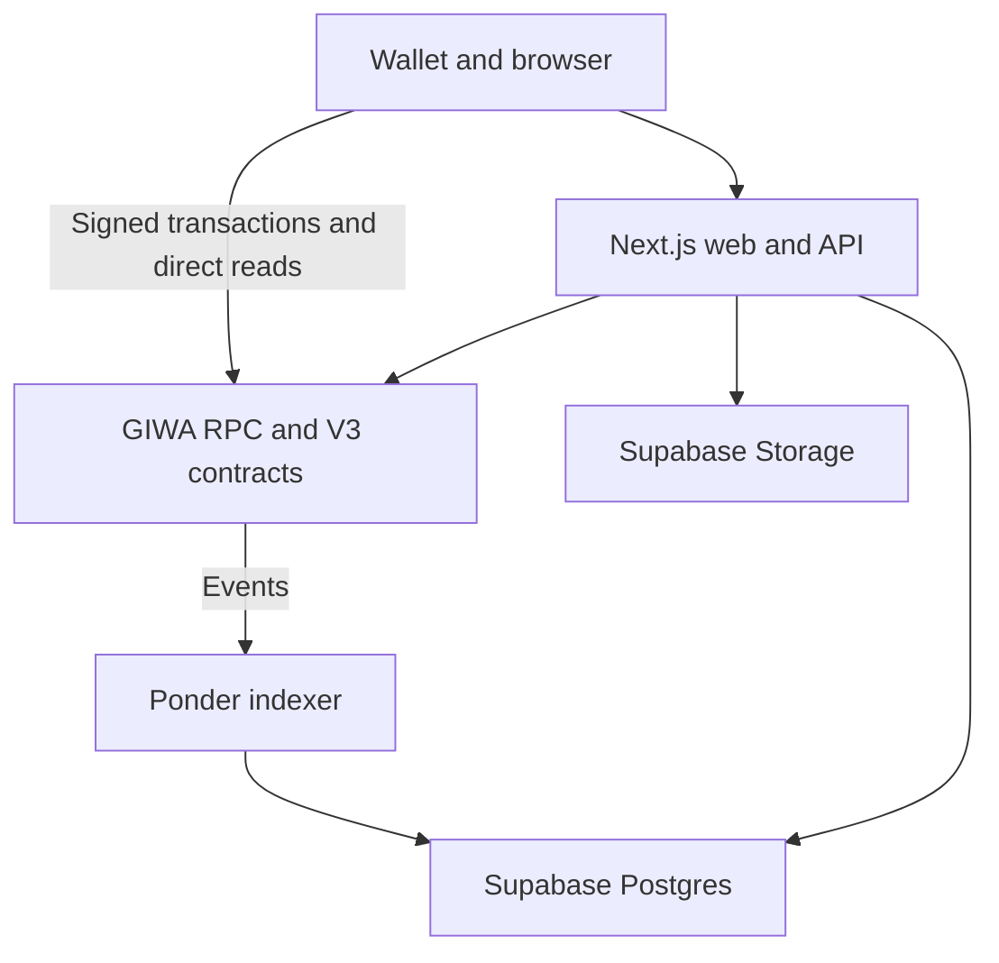

DualClash V3 separates financial authority, public indexing, readable content, and wallet interaction so each layer has a narrow responsibility.

<Info>
  **Current scope:** Tomborg V3 on GIWA Sepolia, chain ID `91342`. Tomborg is the repository and protocol name; DualClash is the product name.
</Info>

## System context

## Sources of truth

| Concern | Authority |
| --- | --- |
| Reserves, settlement, supply, ownership, stake, votes, and rewards | Contracts and reserve tokens |
| Topic publication | `DebateTopicFactoryV3.TopicCreated` |
| Argument publication | `TopicMarketBaseV3.PostCreated` |
| Content pointer | URI stored onchain |
| Readable MVP content | `public.topics` and `public.comments` resolving `tomborg://` URIs |
| Public history and charts | Rebuildable Ponder projections |
| Current wallet-sensitive values | Direct contract reads |