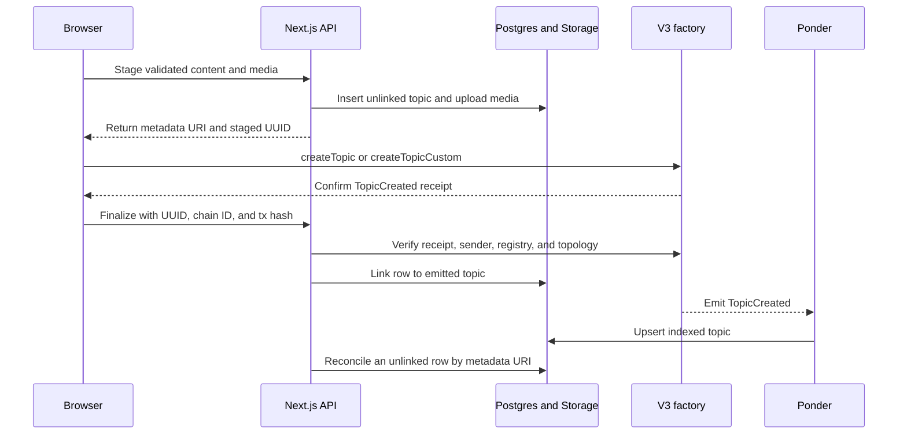

DualClash separates readable content from publication authority. Content may be staged offchain, but only a verified contract event can publish a topic or argument.

## Content model

The shared package defines canonical, versioned payloads:

- `tomborg.topic.v3`
- `tomborg.comment.v1`

Payloads use stable key ordering and Keccak-256 hashing. The current `LocalDbContentStore` creates:

```text
tomborg://topics/<uuid>
tomborg://comments/<uuid>
```

The URI is stored onchain. The content hash is stored offchain, but V3 contract structs and events do not include it. The hash is therefore a content-verification reference, not chain-verifiable evidence, and the current application does not run a background drift detector.

## Topic publication lifecycle



The receipt path provides immediate feedback. Reconciliation repairs the state if the browser closes, finalization times out, or the indexer observes the transaction first.

Only linked V3 rows appear in normal topic lists. `is_listed` can remove a published topic from discovery without deleting it or preventing direct access by topic ID.

## Argument publication lifecycle

<Steps>
  <Step title="Stage">
    Validate the argument and insert its content with `active = false`.
  </Step>
  <Step title="Submit">
    Return its `contentURI` and submit `createPost(side, contentURI)` from the wallet.
  </Step>
  <Step title="Verify">
    Verify the successful `PostCreated` receipt and transaction sender.
  </Step>
  <Step title="Link">
    Link the staged row to the emitted post ID.
  </Step>
  <Step title="Reconcile">
    Let the Ponder-backed repair path recover an interrupted finalization.
  </Step>
</Steps>

The argument feed begins with `idx_argument` and then joins content by URI. A database row without a matching active indexed event is never rendered as published.

## Current trust and abuse caveats

The staging API currently accepts a caller-supplied wallet address, which is corrected from the receipt during finalization. This preserves publication authority, but unauthenticated staging and media uploads remain open to spam and orphaned rows.

The nonce and signature framework exists, but `SIGNED_ACTION_PURPOSES` is empty and current staging routes do not require signatures.

<Warning>
  Current `tomborg://` content depends on the application database and backups. Losing the database makes the onchain pointers unreadable even though the financial and publication events remain intact.
</Warning>

## Permanent-content direction

The intended migration preserves the same state machine:

1. Build canonical JSON.
2. Hash the payload.
3. Upload it to Arweave.
4. Write `ar://<transaction-id>` onchain.

`ArweaveContentStore` is currently a stub. A future contract version may also emit content hashes with URIs.