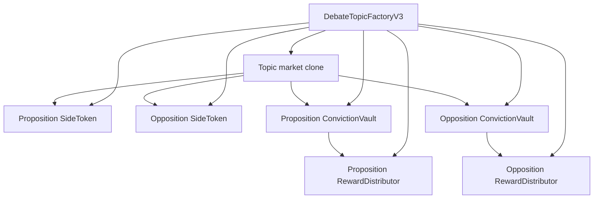

Each DualClash topic is an isolated contract topology with immutable economics. Reserves, side tokens, stakes, votes, and rewards are inspectable per topic rather than pooled through one shared market.

## Per-topic topology

`DebateTopicFactoryV3` selects the reserve-specific implementation and creates one EIP-1167 market clone plus six topic-owned components.



The factory records `topicById`, `isTopic`, and `reserveKindOf`. Implementation contracts are templates only and must not be indexed or rendered as live markets.

## Reserve implementations

Shared market behavior lives in `TopicMarketBaseV3`; only asset movement differs.

| Implementation | User reserve | Internal reserve | Decimals | Buy behavior |
| --- | --- | --- | --- | --- |
| `EthTopicMarketV3` | ETH | Canonical WETH | 18 | Accepts a maximum native payment, wraps quoted cost, and refunds excess ETH |
| `UsdcTopicMarketV3` | mUSDC | `MockUSDC` | 6 | Transfers a maximum ERC-20 payment and refunds excess mUSDC |

The mUSDC contract supports EIP-2612, although the current UI uses ERC-20 approval.

## Reversible market curve

Each side token has:

- a hard maximum supply of 21,000,000 tokens; and
- a reversible curve ceiling of 20,790,000 tokens, or 99% of maximum supply.

Buys mint and sells burn. A complete exit returns that side's supply and curve-reserve contribution to zero.

The reserve function `R(p, o, config)` combines independent logarithmic side pressure, overall topic heat, smoothed contrast between supplies, and configurable pacing. A trade pays or receives the reserve delta:

```text
buy curve cost = R(after) - R(before)
gross buy cost = curve cost + buy fee

gross sell refund = R(before) - R(after)
net sell refund   = gross refund - sell fee
```

Preset selections resolve to a numeric `MarketConfig`. Advanced topics mark presets as `Custom` and pass validated values. The resolved configuration and its hash are immutable.

<Note>
  The Solidity field `depthWei` is historical naming. For mUSDC markets it contains six-decimal reserve units, not wei.
</Note>

Trades enforce deadlines plus maximum-input or minimum-output bounds. Curve validation rejects zero amounts, supply above the ceiling, invalid configuration, and non-positive reserve deltas.

## Fees and rewards

Every trade fee is split as:

```text
creator fee + platform fee + side reward fee = total trade fee
```

The reward share goes to the traded side's `ReserveRewardDistributor` and accumulates per vault share. If that side has no stakers when a fee is accrued, the reward share is redirected to the platform so it cannot become stranded.

Market reserve, creator fees, and platform fees remain liabilities of the topic market. Reward assets are transferred to the distributor and accounted separately. `isReserveSolvent()` checks that the market's reserve-token balance covers all liabilities still held by the market.

## Conviction, arguments, and votes

- Staking transfers liquid side tokens into the matching conviction vault.
- Vault shares remain one-for-one with staked token units.
- A factory-wide immutable cooldown controls withdrawal timing.
- Publishing requires stake on that side to meet `minCommentStake`.
- Voting power equals the user's staked balance on that side.
- Allocated votes cannot exceed unused side voting power.
- Stake supporting active votes cannot be withdrawn.
- Removing a post marks it inactive, but vote removal stays available so stake cannot become trapped.

## Administrative limits

The factory owner can change the topic-creation fee and default treasury for future topics, and withdraw collected creation fees. Those actions cannot change an existing topic's creator, treasury, reserve kind, curve, fees, or comment threshold.

There is no market pause, upgrade hook, reserve migration, or privileged trade. Asset-moving entry points use reentrancy guards, and only the factory can perform one-time initial seeding.