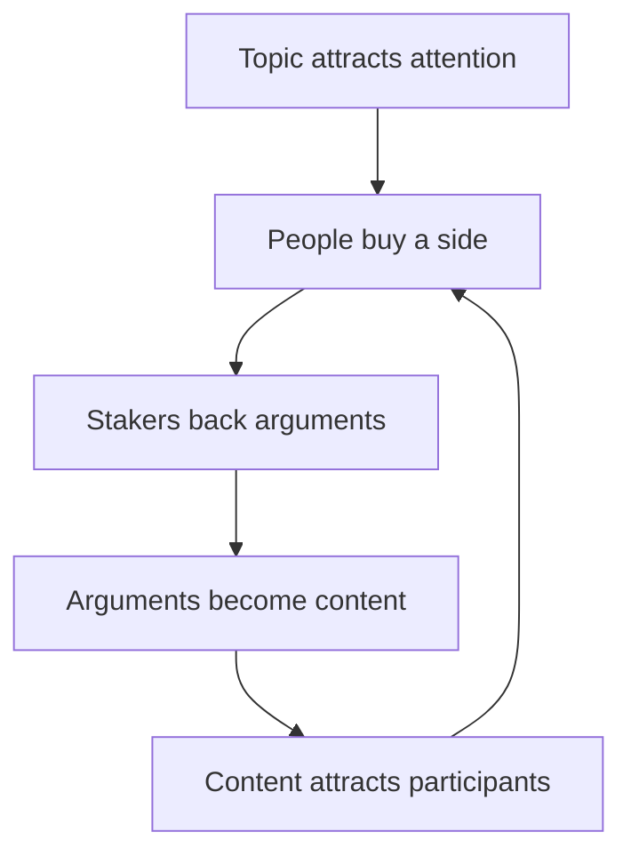

> **Thesis:** Public debate already behaves like an attention market. DualClash gives it an onchain structure: two stance tokens make conviction visible, while arguments give that conviction meaning.

## From attention to conviction

Meme tokens can make attention liquid, but attention moves quickly. Public disagreements are more durable because people identify with a side, defend it, and persuade others.

Two opposing stance tokens fit this behavior naturally. They let each community build support independently while keeping both positions visible in one shared arena.

## From engagement to commitment

Likes, reposts, and polls are cheap signals. Buying and staking a stance token adds cost and persistence. This does not make capital equal to truth; it makes commitment legible.

The market shows **where** attention and conviction are gathering. The argument layer shows **why**.

## A token as social identity

A stance token is more than exposure to a market:

- **Identity:** holding signals which side a participant belongs to.
- **Role:** holding, staking, arguing, and curating represent different forms of participation.
- **Recognition:** useful contributions and visible commitment can build reputation within the side.
- **Coordination:** holders can find one another and organize around a shared position.

Recognition should reflect contribution and commitment—not wallet balance alone.

## The conviction loop

The intended result is a reinforcing loop in which **topics create markets, markets fund attention, and arguments give attention meaning**.

## Product principles

<CardGroup cols={2}>
  <Card title="Two sides, one arena" icon="people-arrows">
    Both positions remain comparable and visible inside the same topic.
  </Card>

  <Card title="Conviction over empty engagement" icon="shield-heart">
    Incentives favor sustained commitment and useful arguments.
  </Card>

  <Card title="Clear before clever" icon="sparkles">
    Users begin with a familiar action—choose a side—before meeting deeper mechanics.
  </Card>

  <Card title="Markets do not decide truth" icon="scale-balanced">
    Economic support is a signal to interpret, not a verdict to obey.
  </Card>
</CardGroup>